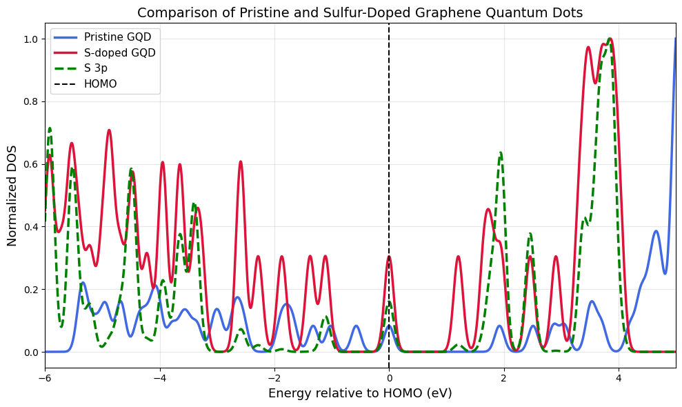

# DFT Study of Sulphur-Doped Graphene Quantum Dots

*Density functional theory investigation of the electronic structure of pristine and sulphur-substituted graphene quantum dots (GQDs), performed with Quantum ESPRESSO.*

[](https://www.quantum-espresso.org/)
[-informational)]()
[]()
[](LICENSE)

---

## Abstract

Heteroatom doping is a well-established route for tuning the electronic properties of graphene-based nanostructures. This project examines the effect of **substitutional sulphur doping** on a hydrogen-passivated graphene quantum dot (C₃₂H₁₄) using first-principles DFT. One carbon atom is replaced by a sulphur atom (C₃₁H₁₄S) and the resulting changes in the density of states (DOS), projected density of states (PDOS), and the HOMO–LUMO gap are compared against the pristine dot. The goal is to understand how sulphur's larger atomic radius and extra valence electrons perturb the π-conjugated electronic structure near the Fermi level.

## Table of Contents

- [Motivation](#motivation)
- [Computational Methodology](#computational-methodology)
- [Structural Models](#structural-models)
- [Repository Structure](#repository-structure)
- [Results](#results)
- [Key Findings](#key-findings)
- [Reproducing the Calculations](#reproducing-the-calculations)
- [Future Work](#future-work)
- [References](#references)
- [Citation](#citation)
- [Author](#author)
- [License](#license)

---

## Motivation

Graphene quantum dots are of interest for optoelectronic and sensing applications because their electronic structure can be tuned through size, edge termination, and heteroatom doping. Sulphur, being isovalent-adjacent to carbon but larger and more polarizable, is known to introduce localized states and modify π-conjugation in doped carbon nanostructures. This repository documents a self-contained, reproducible DFT workflow for quantifying that effect on a finite GQD model.

## Computational Methodology

All calculations were performed with **Quantum ESPRESSO 7.5** using plane-wave, ultrasoft pseudopotentials within the PBE-GGA exchange-correlation functional.

| Parameter | Pristine GQD | Sulphur-Doped GQD |
|---|---|---|
| Calculation type | `relax` → `scf` → `nscf` → `dos`/`projwfc` | `relax` → `scf` → `nscf` → `dos`/`projwfc` |
| Exchange-correlation | PBE-GGA | PBE-GGA |
| Pseudopotentials | Ultrasoft (GBRV / PSlibrary) | Ultrasoft (GBRV / PSlibrary) |
| Plane-wave cutoff (`ecutwfc`) | 60 Ry | 50 Ry |
| Charge density cutoff (`ecutrho`) | 480 Ry | 400 Ry |
| Number of atoms | 46 | 46 |
| k-points | Γ-point (relax/scf), Γ (nscf) | Γ-point (relax/scf), 6×6×1 Monkhorst–Pack (nscf) |
| Ionic relaxation | BFGS | BFGS |
| SCF convergence threshold | 1×10⁻⁸ Ry | 1×10⁻⁹ Ry |
| DOS smearing | Gaussian, `degauss = 0.0022` Ry | Gaussian |
| Simulation cell | 24.7 × 22.1 × 25.0 Å, isolated (vacuum-padded) | 24.7 × 22.1 × 10.0 Å, isolated (vacuum-padded) |

Vacuum spacing in the non-periodic directions was used to prevent spurious interaction between periodic images of the finite quantum dot. PDOS was obtained via `projwfc.x`, projecting the Kohn–Sham states onto the atomic orbital basis of the pseudopotentials.

## Structural Models

| Model | Composition | Doping |
|---|---|---|
| **Pristine GQD** | C₃₂H₁₄ | — |
| **Sulphur-doped GQD** | C₃₁H₁₄S | One substitutional S atom replacing a core carbon site |

The dot is a hydrogen-passivated, coronene-type polycyclic aromatic structure. Sulphur substitution was introduced at an interior carbon site to probe its effect on the delocalized π-system rather than at the edge.

## Repository Structure

```
.
├── pristine/                  # QE input/output for the undoped GQD
│   ├── gqd_relax.in/.out      # Geometry optimization
│   ├── gqd_scf.in/.out        # Self-consistent field calculation
│   ├── gqd_nscf.in/.out       # Non-self-consistent calculation (for DOS/PDOS)
│   ├── gqd_dos.in/.out        # Density of states
│   ├── gqd_projwfc.in/.out    # Projected density of states
│   ├── gqd.dos                # DOS data
│   └── gqd.pdos_tot           # Total PDOS data
├── s_doped/                    # QE input/output for the sulphur-doped GQD
│   ├── sgqd_relax.in/.out, sgqd_relax_1.in/.out
│   ├── sgqd_scf.in/.out
│   ├── sgqd_nscf.in/.out
│   ├── sgqd_dos.in/.out
│   ├── sgqd_pdos.in/.out
│   ├── s_gqd_1.dos
│   └── s_gqd_1.pdos_tot
├── pristine_pdos.png           # PDOS plot — pristine GQD
├── sulphur_doped_pdos.png      # PDOS plot — sulphur-doped GQD
├── comparision.png             # Overlay comparison of both PDOS
└── README.md
```

## Results

### Pristine Graphene Quantum Dot


**Observations**
- Carbon 2p orbitals dominate the frontier electronic states.
- A clear HOMO–LUMO gap is observed, consistent with a closed-shell, edge-passivated aromatic system.

### Sulphur-Doped Graphene Quantum Dot


**Observations**
- Sulphur introduces additional electronic states near the frontier orbitals.
- S 3p orbitals hybridize with the carbon π-network close to the Fermi level.
- The overall electronic structure is measurably perturbed relative to the pristine dot.

### Comparison: Pristine vs. Sulphur-Doped



**Key observations**
- Sulphur doping redistributes the density of states near the Fermi level.
- New states associated with sulphur 3p character appear in the PDOS.
- The HOMO–LUMO gap shifts after doping, indicating an altered electronic response.

## Key Findings

- Substitutional sulphur doping introduces localized electronic states within the π-conjugated framework of the GQD.
- Measurable changes in the electronic structure occur near the Fermi level.
- The HOMO–LUMO gap is altered upon doping relative to the pristine dot.
- PDOS analysis confirms sulphur 3p orbital contributions to the frontier states.

## Reproducing the Calculations

**Requirements**
- [Quantum ESPRESSO](https://www.quantum-espresso.org/) ≥ 7.5
- Ultrasoft pseudopotentials matching those referenced in the `.in` files (GBRV / PSlibrary)
- Python 3 with NumPy and Matplotlib (for post-processing/plotting)

**Workflow** (run from within `pristine/` or `s_doped/`):

```bash
# 1. Geometry relaxation
pw.x -in gqd_relax.in > gqd_relax.out

# 2. Self-consistent field calculation on the relaxed structure
pw.x -in gqd_scf.in > gqd_scf.out

# 3. Non-self-consistent calculation for a denser k-point sampling
pw.x -in gqd_nscf.in > gqd_nscf.out

# 4. Density of states
dos.x -in gqd_dos.in > gqd_dos.out

# 5. Projected density of states
projwfc.x -in gqd_projwfc.in > gqd_projwfc.out
```

> **Note:** the `outdir` and `pseudo_dir` paths in the provided `.in` files point to the original working environment and should be updated to match your local setup before rerunning.

## Future Work

- Formation energy of the sulphur-doped structure relative to the pristine dot
- Charge density difference analysis
- Bader charge analysis
- Band structure calculations
- Optical absorption properties (TDDFT / BSE)
- Alternative sulphur doping configurations (edge vs. interior sites)
- Electron transport calculations

## References

1. P. Giannozzi et al., *J. Chem. Phys.* **152**, 154105 (2020).
2. P. Giannozzi et al., *J. Phys.: Condens. Matter* **21**, 395502 (2009).
3. J. P. Perdew, K. Burke, M. Ernzerhof, *Phys. Rev. Lett.* **77**, 3865 (1996). — PBE exchange-correlation functional

## Citation

If you use this repository or its results, please cite it as:

```
Todurkar, N. D. (2026). DFT Study of Sulphur-Doped Graphene Quantum Dots.
GitHub repository: https://github.com/nihaltodurkar-cms/DFT-of-Sulphur-Doped-Graphene-Quantum-Dot
```

## Author

**Nihal Deepak Todurkar**
B.Tech, Metallurgical & Materials Engineering
National Institute of Technology Karnataka (NITK)

Interested in Computational Materials Science • Semiconductor Devices • Density Functional Theory

## License

Released under the [MIT License](LICENSE).
