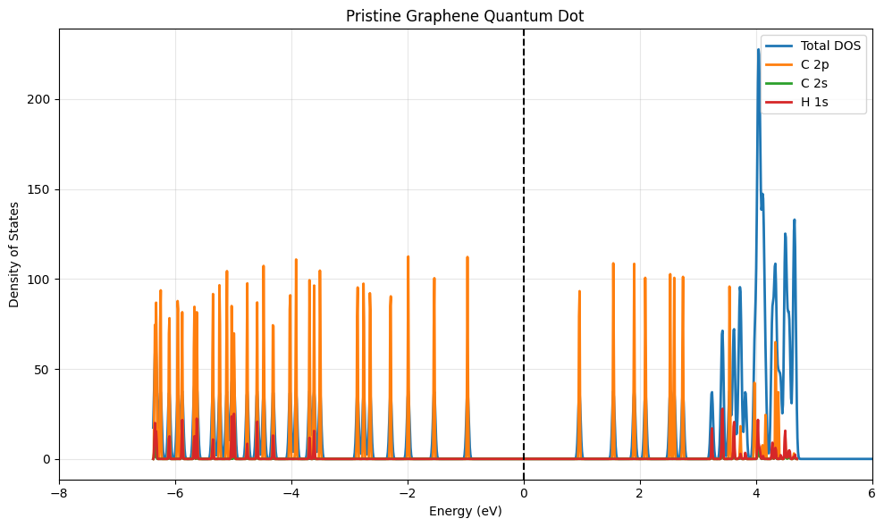
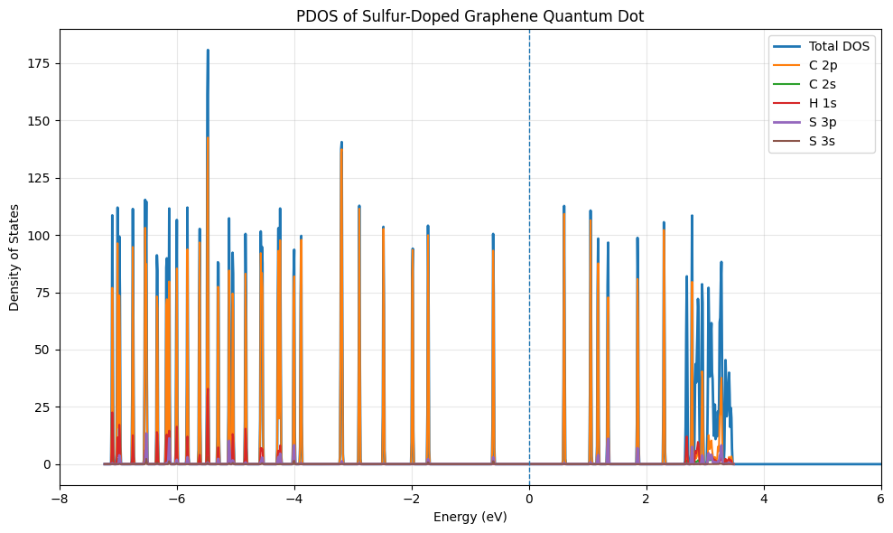

DFT of Sulphur-Doped Graphene Quantum Dot

Project Overview

This repository presents a Density Functional Theory (DFT) investigation of pristine and sulphur-doped graphene quantum dots (GQDs) using Quantum ESPRESSO.

The objective is to understand how sulphur substitution modifies the electronic structure of graphene quantum dots by comparing:

* Optimized geometry
* Density of States (DOS)
* Projected Density of States (PDOS)
* HOMO-LUMO gap
* Electronic states near the Fermi level

⸻

Software

* Quantum ESPRESSO 7.5
* PBE-GGA Exchange Correlation Functional
* Ultrasoft Pseudopotentials
* Python (NumPy, Matplotlib)

⸻

Results

Pristine GQD

* Relaxed structure
* DOS
* PDOS
* HOMO-LUMO gap

Nitrogen-Doped GQD

* Optimized geometry
* DOS
* PDOS
* Modified electronic states
* Comparison with pristine GQD

  ## Results

### Pristine Graphene Quantum Dot

**Observation**
- Carbon 2p orbitals dominate the frontier electronic states.
- A clear HOMO–LUMO gap is observed.

---

### Sulfur-Doped Graphene Quantum Dot

**Observation**
- Sulfur introduces additional electronic states.
- S 3p orbitals contribute near the frontier states.
- The electronic structure is modified compared with the pristine GQD.

---

### Comparison of Pristine and Sulfur-Doped GQD

**Key observations**
- Sulfur doping modifies the density of states near the Fermi level.
- Additional states associated with sulfur appear in the PDOS.
- The HOMO–LUMO gap changes after doping, indicating altered electronic properties.
⸻

Key Findings

* Sulphur substitution introduces localized electronic states.
* Electronic structure changes are observed near the Fermi level.
* The HOMO-LUMO gap is altered after doping.
* PDOS indicates contributions from nitrogen orbitals around frontier energy levels.

⸻

Future Work

* Formation energy
* Charge density difference
* Bader charge analysis
* Band structure
* Optical properties
* Different nitrogen configurations
* Transport calculations

⸻

References

1. P. Giannozzi et al., Journal of Chemical Physics, 152, 154105 (2020).
2. P. Giannozzi et al., Journal of Physics: Condensed Matter, 21, 395502 (2009).

⸻

Author

Nihal Deepak Todurkar

B.Tech Metallurgical & Materials Engineering

National Institute of Technology Karnataka (NITK)

Interested in Computational Materials Science • Semiconductor Devices • Density Functional Theory
